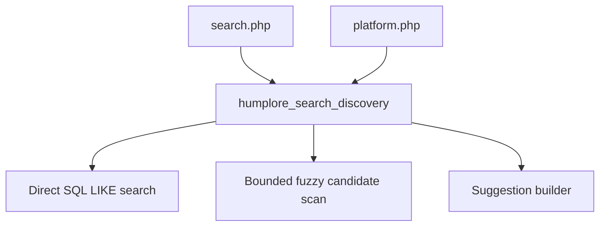

# Implementation Plan: Search Discovery Foundation

## Technology Stack

- Frontend: Existing PHP-rendered pages with inline page styles.
- Backend: Existing PHP helper architecture under `app/support`.
- Database: Existing SQLite database via PDO.

## Architecture

## Component Design

### Shared Search Helper

- Responsibility: Normalize queries, run direct SQL search, build suggestion terms, and expand near matches when direct results are weak.
- Interface: `humplore_search_discovery(PDO $pdo, string $query, array $options = []): array`.
- Dependencies: Existing `humplore_platform_posts_select_sql()`, `txt_lower()`, PDO.

### Page Integration

- `platform.php` continues to consume `humplore_platform_load_search_results()`, which delegates to the shared search helper.
- `search.php` replaces its duplicated SQL with the helper and renders suggestions/related-term messaging.

## Security Considerations

- Query strings remain bound parameters.
- HTML output uses `e()`.
- Fuzzy candidates are read from existing trusted database fields but still escaped on output.

## Performance Strategy

- Keep direct SQL search first.
- Limit candidate terms and fuzzy-expanded result sets.
- Only run fuzzy matching when the query is non-empty and direct results are weak.

## Error Handling

- Missing optional tables such as `Categories` or `CreatorDetails` should fail soft.
- Empty or too-short queries should not trigger expensive fuzzy matching.
