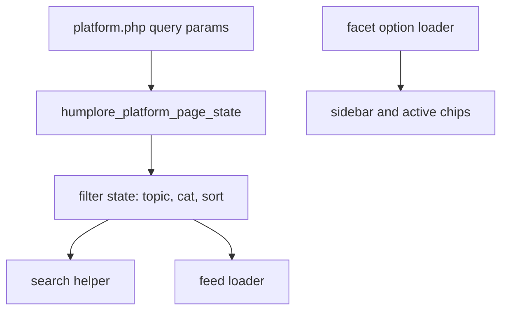

# Implementation Plan: Filter Discovery

## Technology Stack

- Frontend: Existing PHP-rendered `platform.php` with inline page styles.
- Backend: Existing PHP helper architecture under `app/support`.
- Database: Existing SQLite database via PDO.

## Architecture

## Component Design

### Filter State

- Responsibility: Parse and normalize `topic`, `cat`, and `sort` query params.
- Interface: Existing `humplore_platform_page_state(array $query): array` returns the additional state.
- Dependencies: Existing text helper functions.

### Facet Options

- Responsibility: Load selectable creator topics and post contribution categories from existing data.
- Interface: `humplore_platform_load_filter_options(PDO $pdo): array`.
- Dependencies: `Users`, `CreatorDetails`, `Categories`, `Posts`.

### Feed Filtering

- Responsibility: Apply selected topic/category filters to Discover and Following feeds.
- Interface: Extend `humplore_platform_load_feed(...)` with filters and sort.
- Dependencies: Existing `humplore_platform_posts_select_sql()`.

### Search Filtering

- Responsibility: Apply the same filter axes to platform search results.
- Interface: Extend `humplore_search_discovery(..., ['filters' => ..., 'sort' => ...])`.
- Dependencies: Existing search helper and platform post SQL.

## Security Considerations

- Use prepared statements for all filter values.
- Keep URL values escaped when rendered.
- Ignore unsupported sort values.

## Performance Strategy

- Reuse existing indexes/tables for the first implementation.
- Keep feed pagination in place.
- Count filtered feed rows with the same WHERE clause used for the page query.

## Error Handling

- If optional category or creator topic queries fail, render empty facet groups instead of failing the page.
- Empty filters behave like the current unfiltered feed.
