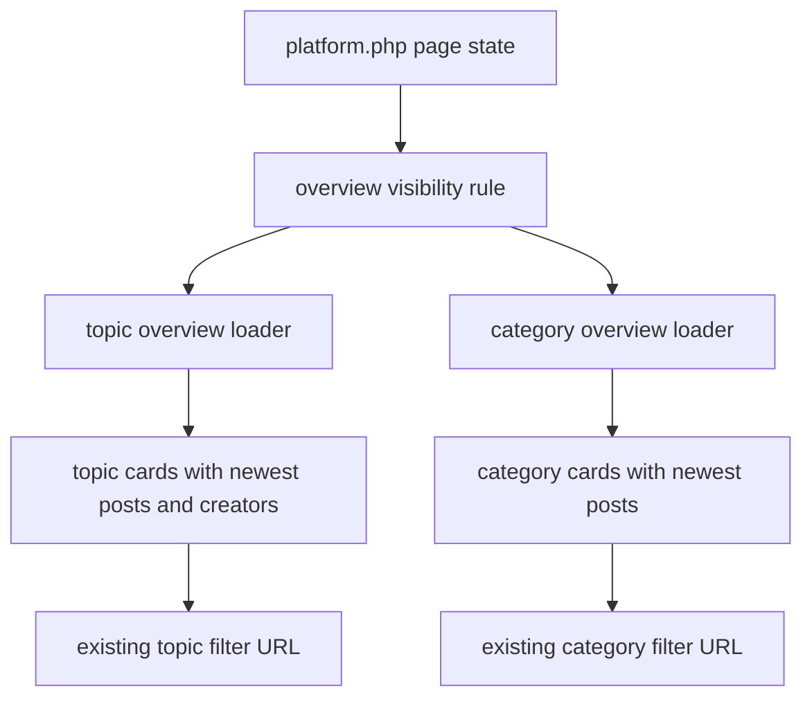

# Implementation Plan: Topic And Category Overview

## Technology Stack

- Frontend: Existing PHP-rendered `platform.php` with page-local styles.
- Backend: Existing PHP helper architecture under `app/support`.
- Database: Existing SQLite database via PDO.
- Routes: Keep `platform.php` as the first delivery route.

## Architecture

## Component Design

### Overview Visibility

- Responsibility: Decide whether the Browse area should be rendered.
- Rule: Render only when there is no active search query, no active topic filter, and no active category filter.
- Dependencies: Existing `humplore_platform_page_state()` values.

### Overview Data Loader

- Responsibility: Load at most 4 topic groups and 4 category groups from existing data.
- Interface: Add a helper such as `humplore_platform_load_overview(PDO $pdo, array $options = []): array`.
- Output: Separate `topics` and `categories` arrays.
- Future extraction: Keep route-specific HTML outside the data loader so another page can reuse the same grouped data later.

### Topic Group Data

- Responsibility: Build topic groups from `COALESCE(CreatorDetails.main_topic, Users.main_topic)`.
- Content: Topic label, optional counts, up to 2 newest matching posts, up to 2 matching creators, and a `platform.php?topic=...` link.
- Dependencies: Existing post select shape and profile image helpers.

### Category Group Data

- Responsibility: Build contribution category groups from existing category data.
- Content: Category label, optional counts, up to 2 newest matching posts, and a `platform.php?cat=...` link.
- Dependencies: Existing `Posts.category`, `Categories`, and `PostCategories` compatibility behavior.

### Browse UI

- Responsibility: Render a compact Browse area above the Explore feed.
- Structure: Two separate sections: "Themen" and "Kategorien".
- Behavior: "Mehr" links navigate into the existing filtered feed instead of expanding inline.
- Mobile: Render inside the main feed column so it remains visible when sidebars are hidden.

## Security Considerations

- Escape all group labels, post titles, creator names, and generated URLs.
- Use prepared statements for per-group preview queries.
- Continue using existing route and CSRF behavior; the overview itself is read-only.

## Performance Strategy

- Cap visible groups to 4 topics and 4 categories.
- Cap previews to 2 posts per group.
- Cap creator previews to 2 creators per topic.
- Prefer simple bounded queries over full recommendation logic.

## Error Handling

- If optional category joins fail, fall back to available `Posts.category` values.
- If a group has no preview posts, still allow the group link when the group is valid.
- If overview loading fails, hide the overview and preserve the normal Explore feed.

## Migration Notes

- No schema migration is required for the first implementation.
- The implementation SHOULD keep grouped data assembly reusable so a later dedicated `topics.php` or `categories.php` route can consume the same helper.
