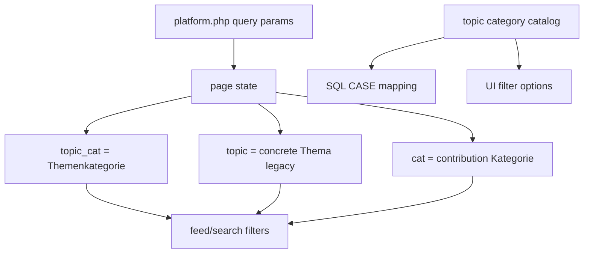

# Implementation Plan: Topic Category Filter Model

## Technology Stack

- Frontend: Existing PHP-rendered `platform.php` with page-local styles.
- Backend: Existing PHP helper architecture under `app/support`.
- Database: Existing SQLite database via PDO.

## Architecture

## Component Design

### Topic Category Catalog

- Responsibility: Define broad topic categories and keyword mappings for concrete topics.
- Interface: helper functions in `app/support/platform-page.php`.
- Output: option labels, SQL CASE expression, and PHP label resolver.

### Filter State

- Responsibility: Parse `topic_cat`, legacy `topic`, `cat`, and `sort`.
- Interface: Extend `humplore_platform_page_state()`.
- Compatibility: Keep `topic` in URLs when present, but generate new primary links with `topic_cat`.

### Query Filtering

- Responsibility: Apply topic-category, concrete-topic, and contribution-category filters.
- Interface: Extend `humplore_platform_filter_where()` and platform search filtering.
- Semantics: Combine active axes with AND.

### UI Integration

- Responsibility: Rename main topic UI to "Themenkategorien" and keep contribution categories as "Kategorien".
- Interface: Update `platform.php` labels, chips, hidden fields, overview links, and section headings.

## Migration Notes

- No schema migration is required.
- Future schema should add `TopicCategories`, `Topics`, and a creator-topic relation.
- The mapping layer should be removable once normalized topic tables exist.
