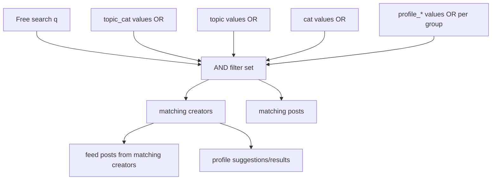

# Implementation Plan: Profile Discovery Filters

## Technology Stack

- Frontend: Existing PHP-rendered Explore page in `platform.php`.
- Backend: Existing PHP helpers under `Webseite - Codex/app/support`.
- Database: Existing SQLite database via PDO, with additive schema changes only for later stages.

## Current Technical Model

- `topic_cat` is parsed into `filters.topicCategory` and is derived from `CreatorDetails.main_topic` or `Users.main_topic` through a central topic-category catalog.
- `topic` is parsed into `filters.topic` and matches the concrete creator topic exactly.
- `cat` is parsed into `filters.category` and matches `Posts.category` plus `Categories`/`PostCategories` where present.
- `CreatorDetails.ort` exists and is displayed on profiles as Wohnort, but it is not filtered.
- `CreatorDetails.sprache` exists and is displayed on profiles, but it is free text and not filtered.
- `Alter`, `Herkunftsland`, and `Geschlecht/Identitaet` do not exist as structured profile fields.

## Target Data Model

### Stage 1: Existing Data

- Use `CreatorDetails.ort` as `profile_city`.
- Use controlled language labels matched against `CreatorDetails.sprache` as transitional `profile_language`.
- Keep `topic_cat`, `topic`, and `cat` behavior unchanged and compatible.

### Stage 2: Additive Profile Model

- Add a creator profile attributes table or additive columns for:
  - `age_group`
  - `origin_country`
  - `gender_identity`
  - `filter_origin_country_enabled`
  - `filter_gender_identity_enabled`
- Add normalized language storage, such as `CreatorLanguages(user_id, language_code)`.
- Keep migration defensive and preserve existing `CreatorDetails.sprache` text during transition.

## URL Contract

- Existing single-value parameters remain valid:
  - `topic_cat=Krankheit`
  - `topic=ADHS`
  - `cat=Alltag`
- New multi-select filters use repeated parameters:
  - `profile_language=Deutsch&profile_language=Englisch`
  - `cat=Alltag&cat=Familie`
- Profile filters use a `profile_` prefix:
  - `profile_city`
  - `profile_language`
  - `profile_age_group`
  - `profile_origin_country`
  - `profile_gender_identity`

## Query Semantics

- Within one filter group: OR.
- Across filter groups: AND.
- Free search plus filters: AND.
- Profile filters restrict creators; feed results are posts by matching creators.

## UI Behavior

- The Explore sidebar keeps separate sections for Themenkategorien and Beitrags-/Lebenskategorien.
- A new collapsible "Profilfilter" section is closed by default.
- If any profile filter is active, active chips are visible near the feed even when the section remains closed.
- Wohnort uses a search input with suggestions loaded from existing creator cities.
- Sprache uses controlled multi-select values.
- Thema remains search and URL compatible, but is not promoted as a main filter.

## File Changes

- `Webseite - Codex/app/support/platform-page.php`: parse repeated filters, add profile-filter state, query helpers, option loading.
- `Webseite - Codex/app/support/search-discovery.php`: apply profile filters to profile and post search paths.
- `Webseite - Codex/platform.php`: add collapsible profile-filter UI, active chips, hidden form preservation.
- `Webseite - Codex/app/support/profile-page.php`: later stage reads new profile fields for display/editing.
- `Webseite - Codex/app/views/partials/profile-settings-modal.php`: later stage edits age group, languages, origin country, gender/identity, consent toggles.

## Verification Strategy

- Syntax-check changed PHP files with `php -l`.
- Add focused local smoke checks for:
  - legacy `cat=Alltag`
  - repeated `cat=Alltag&cat=Familie`
  - `topic_cat=Krankheit`
  - `profile_city=Hamburg`
  - `profile_language=Deutsch`
  - search plus profile filter
- Verify active chips and hidden form fields preserve all filters.
